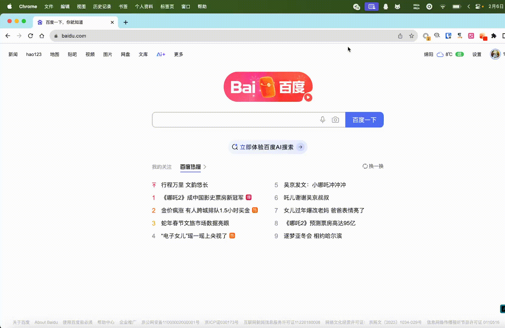

# Finger2FQ 

## Overview

Find web page fingers and convert them to Fofa or Quake syntax. 识别网站特征并生成FOFA/Quake网络空引擎搜索语法的浏览器扩展。

目前支持的特征:
1. Favicon 特征
2. Title 特征

## Usage

## Todo

- [ ] JSName/CssName特征提取
- [ ] AI辅助网页指纹/关键字分析
- [ ] 支持其他空间引擎，如 Hunter, Shodan.(再说吧,主要是不太用到这两款)

## References

https://github.com/zR00t1/iconhash